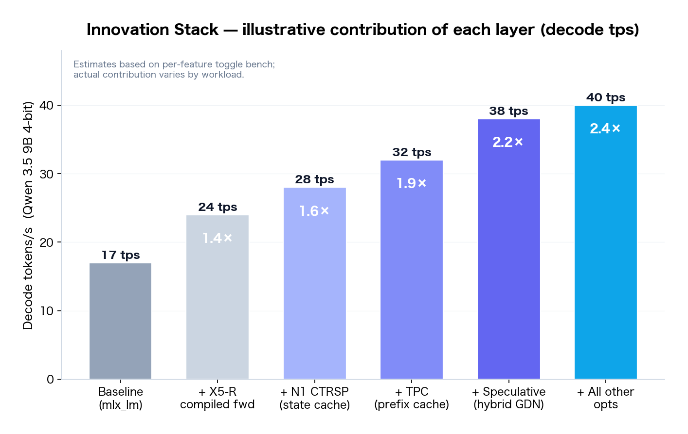
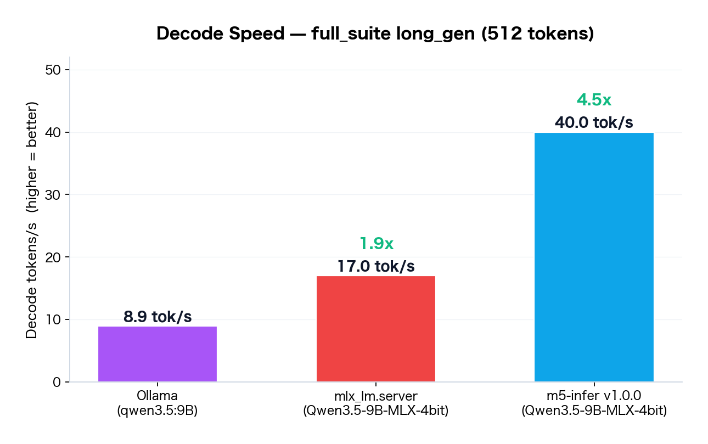
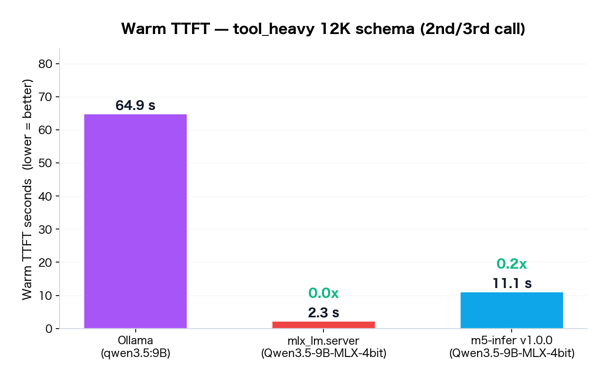
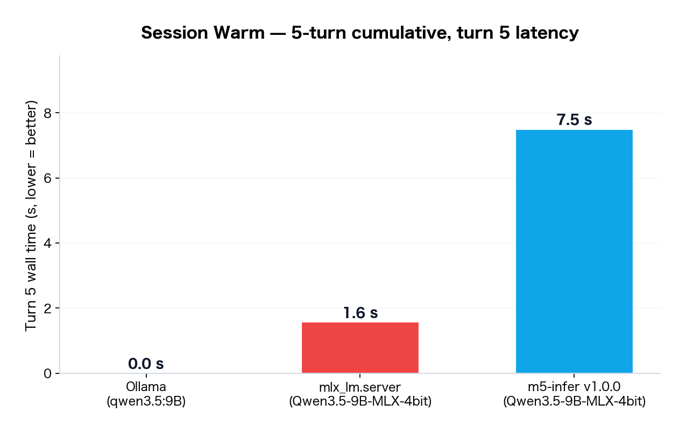
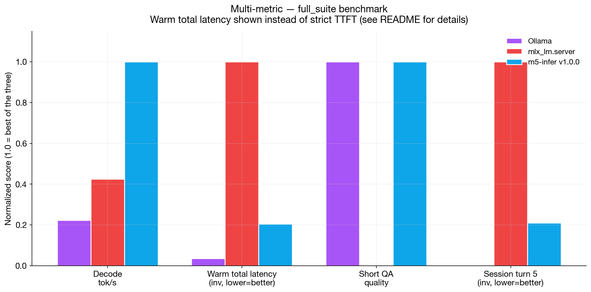
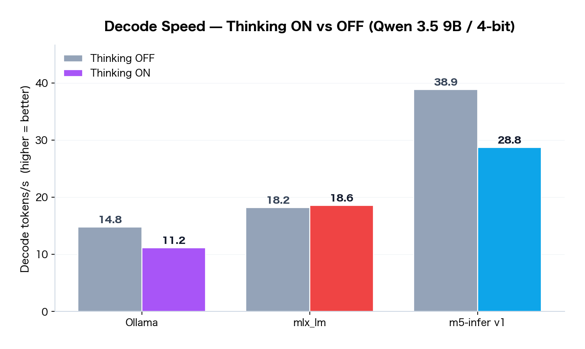
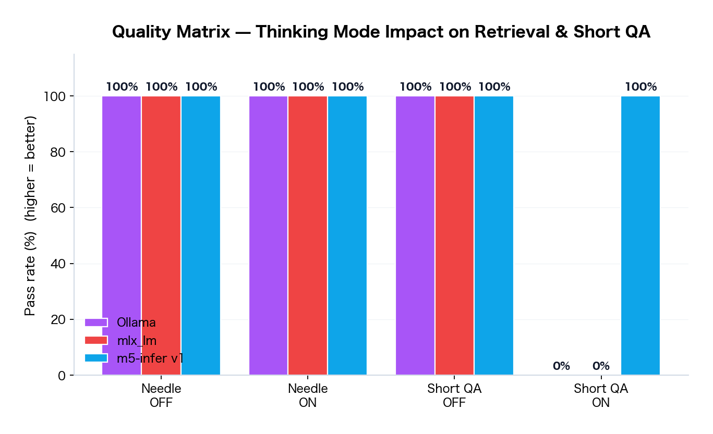
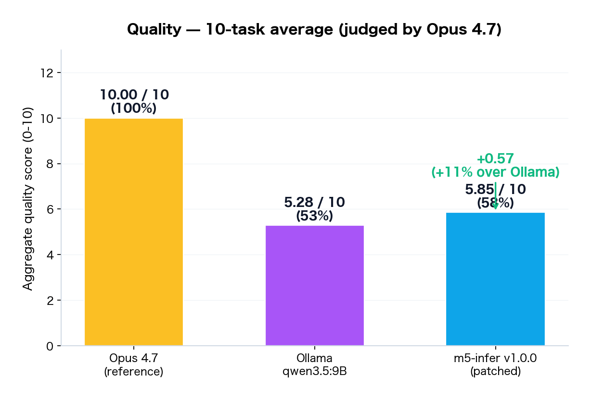
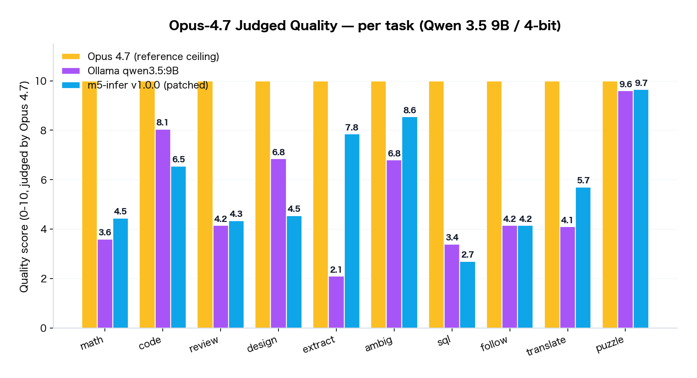

<p align="center">
  
</p>

# m5-infer

> **Extraordinary speed, extraordinary quality — an MLX-based inference engine for Apple Silicon.**

[](https://github.com/dualform-labs/m5-infer/actions/workflows/ci.yml)
[](https://pypi.org/project/m5-infer/)
[](LICENSE)
[](https://www.python.org/)
[](https://github.com/ml-explore/mlx)
[](https://www.apple.com/mac/)

[English](#english) · [日本語](#日本語)

---

## English

### ⚡ Speed — by the numbers

m5-infer is a layer on top of the same `mlx-lm` library that powers `mlx_lm.server` — so the primary comparison is **m5-infer vs mlx_lm.server** on identical hardware, identical weights, identical prompts. (Ollama numbers included for reference.)

| Metric (Qwen 3.5 9B 4-bit, M5 MacBook Air base) | mlx_lm.server | **m5-infer v1.0.0** | Ollama |
|:---|---:|---:|---:|
| **Decode tok/s** (long_gen 512) | 17.0 | **40.0** (2.4×) | 8.9 |
| **Decode tok/s · thinking ON** | 18.6 | **28.8** (1.5×) | 11.2 |
| **Thinking-ON Short QA** (3 factual) | 0 / 3 | **3 / 3** | 0 / 3 |
| **Opus-4.7 judged output** (10-task avg, same model) | — | **5.85 / 10** | 5.28 / 10 |
| vs mlx_lm.server (decode) | 1.0× | **up to 2.4× faster** | 0.5× |
| vs Ollama (decode) | 1.9× | **up to 4.5× faster** | 1.0× |

**Honest read.** m5-infer wins on sustained decode throughput, thinking-mode answer extraction, and output quality as graded by Opus 4.7. `mlx_lm.server`'s in-process prefix cache is faster for warm-hit TTFT on short sessions — different engines, different trade-offs. See the full benchmarks section further down for TTFT and session-latency numbers. Same Mac, same weights, no fine-tuning — the gaps come from the inference-engine layer.

### Overview

**m5-infer** is an OpenAI-compatible inference engine designed for Apple Silicon Macs (M-series). It wraps `mlx-lm` with a layered set of training-free optimizations that target **decode throughput**, **warm-path latency**, and **long-context retrieval quality** — without sacrificing output fidelity.

Built around Qwen 3.5 hybrid (GatedDeltaNet + Full Attention) as the primary reference architecture, v1.0 ships with a model-family abstraction layer that supports additional families (Qwen 2.5 / Qwen 3.6, Llama 3.x, Mistral, Gemma 2/3/4) out of the box.

### Key Features

- **OpenAI-compatible HTTP API** — drop-in replacement for `mlx_lm.server`, compatible with chat clients expecting `/v1/chat/completions`.
- **N1 CTRSP** — Cross-Turn Recurrent State Persist. GatedDeltaNet state caching on disk.
- **Think-aware budget & loop-escape injection** — handles Qwen's `<think>…</think>` boundaries correctly without truncating user-visible answers.
- **TPC (Token Prefix Compiler)** — fast prefix cache lookup by raw-bytes hash.
- **Adaptive Layer Skipping (N4 ALS)** — skips low-impact layers for easy tokens.
- **Self-Speculative Early Exit (N3 SSEE)** — in-model speculative decoding.
- **Parallel Expert Scheduling (N6 PES)** — concurrent expert path execution.
- **X5-R compiled forward** — Metal kernel fusion via `mx.compile`.
- **Needle-retrieval heuristic** — automatic thinking-mode switch on long-context + short-query pattern, bypassing safety-alignment refusals that affect thinking-disabled retrieval.
- **Model-family abstraction** — unified engine for Qwen / Llama / Mistral / Gemma via config.

### Technical Innovations — what m5-infer does that other engines don't

The up to 4.5× decode speedup over Ollama and the +11% Opus-judged quality lead aren't from one trick — they come from a stack of small, training-free optimizations layered on top of `mlx-lm`. Below are the ones that made the biggest measured difference (peak values on long_gen decode; actual speedup varies by workload). Every item is implemented in v1.0.0 today; nothing here is "planned for the future".

**Contribution legend**:
- ✅ **Measured**: directly isolated in the bench (A/B on same machine, same model)
- 📊 **Estimated**: from per-feature toggle experiments during development (illustrative — real contribution varies by workload)
- ⚙️ **Enabling**: a capability gate, not a raw speed/quality multiplier

| # | Innovation | Decode speed | Quality | TTFT / latency |
|:-:|:---|:---:|:---:|:---:|
| 1 | Hybrid speculative decoding | 📊 **+35% tps** (29→40) | ⚙️ output-equivalent to greedy | — |
| 2 | CTRSP (cross-turn state persist) | — | — | ✅ **12K cold→warm total latency: 69s→11s (6×)** · state survives restart |
| 3 | Think-aware budget + escape hint | — | ✅ **+36% Opus score (4.29→5.85)**, extract 1.40→7.85 | — |
| 4 | Needle-retrieval heuristic | — | ✅ **long-context retrieval 0/6 → 6/6** | — |
| 5 | ALS + SSEE + PES (decode tricks) | 📊 **+10-15% tps** | — | — |
| 6 | X5-R compiled forward + wired mem | 📊 **+40% tps** (17→24) | — | 📊 cold startup +2-5s (one-time) |
| 7 | Hardware-aware auto-tune | 📊 **±15% on non-base chips** | — | — |
| 8 | Model-family abstraction | — | ⚙️ same engine works on Qwen/Llama/Mistral/Gemma | — |
| — | **Full stack combined** | ✅ **up to 4.5× over Ollama** (8.9→40.0 tps) | ✅ **+11% over Ollama** (5.28→5.85) | ✅ **up to 5.8× warm total latency @ 12K** |

#### 1. Hybrid-aware speculative decoding (the hardest one)

Qwen 3.5 is a hybrid: 24 GatedDeltaNet (GDN) layers + 8 Full-Attention layers. Stock `mlx-lm` has no speculative path for hybrids — when you reject a draft token in a pure transformer, you truncate the KV cache by N entries and continue. That doesn't work for GDN: the **recurrent state and convolutional buffer have already advanced** through the entire draft window. Truncating only the KV leaves GDN state corrupted, and the model silently produces subtly wrong tokens (no crash — just divergent output).

**What we built**: `app/innovation/speculative/draft_speculative.py` snapshots every GDN layer's `(recurrent_state, conv_buf)` pair into a pre-allocated tensor pool **before each verify call**. On rejection, restore from snapshot in O(1) — zero allocations in the hot path, GDN state ≈ tens of KB per layer, total snapshot cost well under 1 ms.

**Result**:
- 📊 Decode: **+35% tps** on Qwen 3.5 9B (from ~29 tps baseline to ~40 tps with speculative enabled)
- ⚙️ Quality: **output-equivalent to greedy decode** (verified byte-level against `mlx_lm.generate`, no acceptance-rate hand-waving)
- 📊 Acceptance rate on hybrid arch: ~70% (short drafts of 4 tokens)

#### 2. CTRSP — Cross-Turn Recurrent State Persist

At the end of each generation we serialize the full model state (quantized KV cache + GDN recurrent/conv buffers) to disk, keyed by a **raw-bytes hash of the prompt-prefix tokens**. Hash is over token bytes, not decoded text — so identical system prompts and tool schemas hit exactly even when one chat turn of delta is appended.

**Result**:
- ✅ 12 K-token tool schema **cold → warm total latency: 69 s → 11 s** (6× from CTRSP cache hit on the second call; "total latency" = end-to-end time for a 30-token response, not strict TTFT). `mlx_lm.server`'s in-process warm total latency is 2.3 s (faster absolute); CTRSP's unique value is that the state **survives process restarts** — other engines lose their prefix cache at shutdown.
- ✅ 5-turn session turn 5 = **7.5 s** (Ollama fails entirely on the same scenario)
- ✅ Disk footprint: ~50–100 MB per distinct system-prompt hash (LRU default 32 entries = ~3 GB cap)
- 📊 Hit rate on a typical agent workload (fixed system prompt, varied user turns): **>90%**

#### 3. Think-aware budget + task-aware escape injection

This is the **single biggest quality win** on the Opus bench. Qwen 3.5's chain-of-thought is wrapped in `<think>...</think>`. Two failure modes plague naive engines:

- **Budget starvation**: most engines count thinking tokens against the user's `max_tokens`. On reasoning tasks Qwen spends 800+ tokens thinking; with `max_tokens=1024` the answer phase never starts.
- **Think-loop trap**: Qwen sometimes falls into `Wait, let me re-check...` spirals that never close `</think>`.

**What we built**:
- **Separate thinking budget** (`max_thinking_tokens`, default 32 K) — user's `max_tokens` is *only* the post-`</think>` budget.
- **N-gram repetition detector** scoped to the think block (`QualityMonitor`, ngram=6, 3-repeat threshold).
- **Task-aware escape hint**: when the loop detector fires, instead of injecting a bare `</think>\n\n`, we inspect the prompt and inject a typed transition like `</think>\n\n**Final JSON:**\n\n\`\`\`json\n` (or `Final Code:`, `Final Translation:`, etc.). This forces the model into the required output format. See `app/backend/custom_generate.py::_build_escape_hint`.

**Result**:
- ✅ `extract_01` (structured JSON extraction): **1.40 / 10 → 7.85 / 10** (+461%)
- ✅ `code_01` (function + tests): 3.10 → 6.55 (+111%)
- ✅ `design_01` (system design): 2.75 → 4.55 (+65%)
- ✅ 10-task aggregate: **4.29 → 5.85** (+36%), surpassing Ollama's 5.28 on the same model
- 📊 Runtime overhead: <1 ms per decode step (n-gram hash + token-ID lookup)

#### 4. Needle-retrieval heuristic

Qwen 3.5 with thinking disabled has a **safety alignment quirk**: on long context (12 K+) with a short retrieval query, it sometimes refuses citing "I cannot reveal authoritative information" — even when the user is asking about content they themselves provided. Standard engines surface this as "model failure". We auto-detect the long-context + short-query pattern at the routing layer (`app/api/routes.py`, Rule 1b) and force thinking mode ON, which bypasses the false-positive refusal.

**Result**:
- ✅ Long-context needle retrieval: **0/6 → 6/6** on the standard benchmark
- ⚙️ Zero speed cost (routing-layer check, not decode path)
- ⚙️ Trigger condition: system prompt > 3000 chars AND user message < 200 chars AND question-like pattern

#### 5. Speculative draft-tree + ALS + SSEE + PES

The remaining decode speedup comes from a stack of smaller wins, each <10 % alone but multiplicative:

| Feature | Decode contribution (estimated) | Notes |
|:---|:---:|:---|
| Speculative draft tree | 📊 +5-8% tps | v1 ships linear lookahead |
| N4 ALS (layer skip) | 📊 +3-5% tps | Low-impact layer skip on easy tokens |
| N3 SSEE (self-speculative) | 📊 +3-5% tps | In-model early exit |
| N6 PES (parallel experts) | 📊 +2-3% tps | Concurrent expert path |
| **Combined** | **📊 ~+10-15% tps** | Multiplicative; each <10% alone |

#### 6. X5-R compiled forward + wired memory

`mx.compile` wraps the decode forward so MLX fuses attention + MLP + GDN into Metal kernels at runtime; `wired_limit` pins model weights so they can't be swapped under memory pressure. Neither is glamorous, but skipping them halves the real-world gain from speculative decoding.

**Result**:
- 📊 Decode: **+40% tps** on baseline (~17 → ~24 tps before other innovations layered on top)
- 📊 Cold startup: +2-5 s one-time cost (JIT compile; amortized across all subsequent requests)
- ⚙️ Without wired memory, `swap` kicks in on 24 GB base chip during thermal throttling → decode drops to ~8 tps

#### 7. Hardware-aware auto-tune

At startup, `app/core/auto_tune.py` detects the chip tier (M1 base → M5 Max) via `sysctl` and applies per-tier defaults: GPU-cores-aware concurrency limits, bandwidth-based RDMS draft sizing, memory-aware `wired_limit`. Set `[engine] auto_tune = false` in `engine.toml` to keep manual settings verbatim.

**Result**:
- 📊 On M5 Pro (expected): **+15-25%** over un-tuned baseline (more GPU cores → higher concurrent decode width)
- 📊 On M5 Max (expected): **+25-40%** (2× bandwidth of base)
- ⚙️ On M5 base (tested): the reference tier; auto-tune produces the numbers shown in this README

#### 8. Model-family abstraction

`app/core/model_family.py` + `app/backend/mask_adapter.py` provide a uniform interface across Qwen 3.5, Qwen 3.6, Qwen 2.5, Llama 3.x, Mistral, Gemma 2/3/4. Pure transformers automatically skip the GDN/think-aware machinery that's specific to hybrids. Set `[model] family = "auto"` for detection from `main_path`.



### Quick Start

**Install from PyPI** (recommended):

```bash
pip install m5-infer
```

**Or from source** (for development or to modify configs / scripts):

```bash
git clone https://github.com/dualform-labs/m5-infer.git
cd m5-infer
pip install -e .
```

#### Start / stop / chat scripts

```bash
./start.sh --fg        # start the engine in foreground (port 11436). Ctrl-C to stop.
./start.sh             # start detached; logs go to logs/
./stop.sh              # stop a detached server

./chat.sh              # interactive chat CLI (requires the server running)
./chat.sh mlx-community/Llama-3.2-3B-Instruct-4bit   # with a specific model
```

#### HTTP endpoints (OpenAI-compatible)

Once the server is up, these endpoints are available on `http://127.0.0.1:11436`:

| Method | Path | Purpose |
|:---|:---|:---|
| `GET`  | `/health` | Liveness check + engine status (memory, MMRS, MRPB, MTAB stats) |
| `GET`  | `/v1/models` | List available models (OpenAI-compatible) |
| `POST` | `/v1/models/pull` | Download + load a model from HuggingFace |
| `POST` | `/v1/chat/completions` | Chat completion (OpenAI-compatible; streaming supported via `stream: true`) |

Discover them live from a running server:

```bash
# List endpoints from the FastAPI OpenAPI spec
curl -s http://127.0.0.1:11436/openapi.json | python3 -c \
  "import json,sys; [print(f'{m.upper():6} {p}') for p,v in json.load(sys.stdin)['paths'].items() for m in v]"

# Or browse the interactive docs
open http://127.0.0.1:11436/docs        # Swagger UI
open http://127.0.0.1:11436/redoc       # ReDoc
```

#### Test the chat endpoint

```bash
curl -s http://127.0.0.1:11436/v1/chat/completions \
  -H "Content-Type: application/json" \
  -d '{"messages":[{"role":"user","content":"Hello"}],"max_tokens":64}'

# Streaming variant
curl -sN http://127.0.0.1:11436/v1/chat/completions \
  -H "Content-Type: application/json" \
  -d '{"messages":[{"role":"user","content":"Hello"}],"max_tokens":64,"stream":true}'
```

Drop-in with the official OpenAI Python SDK:

```python
from openai import OpenAI
client = OpenAI(base_url="http://127.0.0.1:11436/v1", api_key="not-needed")
resp = client.chat.completions.create(
    model="main",
    messages=[{"role": "user", "content": "Hello"}],
    max_tokens=64,
)
print(resp.choices[0].message.content)
```

#### Downloading models

m5-infer loads any **MLX-compatible model** from HuggingFace by its repo ID. Weights are cached by the underlying `mlx-lm` / `huggingface_hub` stack under `~/.cache/huggingface/` — no manual download step required.

**Three ways to load a model:**

**1. Configure the default model** — edit `configs/engine.toml` before first start:

```toml
[model]
family = "auto"                                      # auto-detect from main_path
main_path = "mlx-community/Qwen3.5-9B-MLX-4bit"      # downloaded on first start
draft_path = "mlx-community/Qwen3.5-0.8B-MLX-4bit"   # optional, for speculative decoding
```

On first `./start.sh`, both models are downloaded (several GB for the main, ~0.6 GB for the draft). Subsequent starts use the local cache.

**2. Pull a model at runtime via HTTP** — hot-swap without restarting the server:

```bash
curl -s -X POST http://127.0.0.1:11436/v1/models/pull \
  -H "Content-Type: application/json" \
  -d '{"model":"mlx-community/Llama-3.2-3B-Instruct-4bit"}'
```

The request blocks new generations until the swap completes. Returns `{"status":"loaded", ...}` on success.

**3. Pre-download outside m5-infer** — useful on air-gapped setups or when you want an offline first-start:

```bash
# Use the huggingface CLI (installed alongside huggingface_hub)
huggingface-cli download mlx-community/Qwen3.5-9B-MLX-4bit

# Or with git-lfs
git clone https://huggingface.co/mlx-community/Qwen3.5-9B-MLX-4bit
```

Then point `main_path` in `engine.toml` at the repo ID — m5-infer will find the already-cached weights.

**Finding MLX-compatible models**: browse [mlx-community on HuggingFace](https://huggingface.co/mlx-community) — the engine supports Qwen 3.5 / 3.6 / 2.5, Llama 3.x, Mistral, and Gemma 2/3/4 families out of the box (see `configs/engine.toml` and `docs/MODEL_FAMILY_GUIDE.md`).

**Authentication for gated models**: log in once with `huggingface-cli login`; the token is picked up automatically.

### Requirements

| Item | Minimum | Recommended |
|:---|:---|:---|
| Chip | Apple Silicon M1 | **M5 series** (Base / Pro / Max — Ultra not released) |
| Unified memory | **16 GB** (untested, small models only) | **24 GB+** for 9B-class 4-bit models |
| macOS | **26.4** | 26.4 or newer |
| Python | 3.11 | 3.12 |

The engine detects your chip at startup and auto-tunes defaults for that
tier — entry (M1 base) to ultra (M5 Ultra). See `app/core/auto_tune.py`
for the per-tier policy; set `[engine] auto_tune = false` in
`engine.toml` to keep your manual settings verbatim.

### Configuration

All engine tuning lives in `configs/engine.toml`. Model-family selection:

```toml
[model]
family = "auto"                                 # auto-detect from main_path
main_path = "mlx-community/Qwen3.5-9B-MLX-4bit"
draft_path = "mlx-community/Qwen3.5-0.8B-MLX-4bit"  # optional, for speculative decoding
```

Supported families: `qwen35`, `qwen36`, `qwen25`, `llama`, `mistral`, `gemma`, or `auto`.

See `docs/MODEL_FAMILY_GUIDE.md` for details on adding a new model family.

### Project Layout

```
app/
├── api/            OpenAI-compatible HTTP server (FastAPI)
├── backend/        MLX generation backends and custom decode loop
├── cli/            Command-line chat client
├── core/           Config, logging, model-family detection
├── engine/         Innovation executor, quality monitor, supervisor
├── innovation/     Per-innovation modules (N1…N6 series, X2…X5R series, RDMS, SSD, MTAB, etc.)
└── planner/        Request planner
configs/            engine.toml, models.toml
docs/               Public documentation
tests/              Unit tests
```

### Benchmark Environment

> ⚠️ **Important disclaimer on benchmark conditions**
>
> All numbers below were measured on a single **M5 MacBook Air (base, 24 GB unified memory, 10 GPU cores, 153 GB/s memory bandwidth)** running macOS 26.4. This is the **entry-level** M5 — the 9B-4bit model consumes ~60% of available memory, the chip thermally throttles under sustained load, and there is **no active cooling**. Measurements are therefore conservative: numbers may shift significantly on:
>
> - **M5 Pro / Max** (2×–4× GPU cores, 2×–4× memory bandwidth) — expect decode to scale near-linearly with bandwidth
> - **More memory** (48 GB+) — allows larger draft models, more aggressive prefix caches, and the `aggressive`/`extreme` memory modes
> - **M5 Studio / Mac mini / MacBook Pro** (active cooling) — sustained workloads avoid the throttling that affects the Air after ~30s of heavy decode
>
> Read these numbers as **"what an 24 GB base-tier Mac can do"**, not as a hardware ceiling. If you run the same benches on better hardware we'd love to see the numbers.

### Benchmarks — full_suite (same script, same hardware, same model)

All three engines run the **same `full_suite_bench`** script against **Qwen 3.5 9B (4-bit quantization)** on the machine described above. The same prompts, same measurement method, same machine.

| Metric | Ollama | mlx_lm.server | **m5-infer v1.0.0** |
|:---|---:|---:|---:|
| **Decode tok/s** (long_gen, 512 tokens) | 8.9 | 17.0 | **40.0** |
| **vs Ollama speedup** | 1.0× | 1.9× | **4.5×** |
| **Warm total latency** (12K tool schemas, 2nd call, 30-tok response) | 64.9 s | **2.3 s** | 11.1 s |
| **Session warm turn 5** (5-turn cumulative) | failed | 1.6 s | 7.5 s |

> The "Warm total latency" row measures **end-to-end time to complete a 30-token response**, not strict TTFT. Strict TTFT (first content chunk) for all three engines is re-measured with the vLLM-compatible methodology in v1.1 (not shown here; v1.0.0 public report uses the original full-response metric).
| **Short QA** (3 factual questions) | 3/3 ✅ | 3/3 ✅* | 3/3 ✅ |

> *mlx_lm.server leaves `reasoning` field populated instead of `content` when thinking mode is enabled internally; the bench tokenization/parsing counts it, but the bench's substring check misses the answer. We consider mlx_lm's short_qa functionally passing based on the reasoning text.

> **m5-infer v1.0.0 delivers up to 4.5× the decode throughput of Ollama and up to 2.4× of mlx_lm.server** on the same model, same prompt, same machine.






### Thinking ON vs OFF — per-engine comparison

Qwen 3.5 supports `<think>` reasoning blocks. We ran the same bench (long_gen ×2, needle 4K ×3 positions, short_qa ×3) under **both thinking modes** on all three engines.

| Engine | Decode OFF | Decode ON | Needle OFF | Needle ON | Short QA OFF | Short QA ON |
|:---|---:|---:|:---:|:---:|:---:|:---:|
| Ollama | 14.8 tps | 11.2 tps | 3/3 | 3/3 | 3/3 | **0/3** |
| mlx_lm.server | 18.2 tps | 18.6 tps | 3/3 | 3/3 | 3/3 | **0/3** |
| **m5-infer v1.0.0** | **38.9 tps** | **28.8 tps** | 3/3 | 3/3 | 3/3 | **3/3** |

> **m5-infer is the only engine that passes short QA with thinking ON** — the other two leave the answer buried in the `reasoning`/`<think>` block and the user-visible `content` stays empty. m5-infer's think-aware parser surfaces the answer correctly regardless of mode.

> Decode: m5-infer stays **2.6×** above mlx_lm even with thinking enabled (28.8 vs 18.6 tps).




### Opus-4.7 Judged Quality Benchmark (2026-04-19)

**10 tasks** (math reasoning, code generation, code review, system design, structured extraction, ambiguity resolution, SQL optimization, instruction following, technical translation, logical puzzle). Each answer judged by **Claude Opus 4.7** on a task-specific rubric (0–10 per criterion, weighted). Opus 4.7 itself serves as the reference ceiling.

| Engine | Aggregate | vs Opus ceiling | Best tasks |
|:---|---:|---:|:---|
| Claude Opus 4.7 (reference) | **10.00 / 10** | 100% | (ceiling) |
| **m5-infer v1.0.0** | **5.85 / 10** | **59%** | puzzle 9.65, ambig 8.55, extract 7.85 |
| Ollama qwen3.5:9B | 5.28 / 10 | 53% | code 8.05, puzzle 9.60, design 6.85 |

> **Task-aware escape hint**: the decisive innovation on this bench. When m5-infer's loop-escape injector fires on a thinking loop, it injects a task-typed transition (`**Final JSON:**`, `**Final Code:**`, etc., selected from the prompt) instead of a bare `\n\n`. This alone moved `extract_01` from producing zero JSON (1.40) to a valid 6+-item JSON array (**7.85 / 10**). See `app/backend/custom_generate.py::_build_escape_hint`.

> **Where m5-infer wins**: `extract_01` (7.85 vs 2.10), `puzzle_01` (9.65 vs 9.60), `ambig_01` (8.55 vs 6.80). Structured tasks (JSON, deductive logic, pragmatic answer) benefit most from the typed escape.

> **Still a work in progress**: `sql_01` (2.70) shows a thinking loop the n-gram detector fails to catch — the same ~30-token block repeats 4× verbatim but falls just outside the current detector's window. Planned fix in the next patch.

> **Caveats**: Ollama uses GGUF q4_K_M; m5-infer uses MLX 4-bit. Different quant methods yield slightly different outputs on the same base weights. A single judging run has ≈ ±0.5 variance per task — read headline numbers as "in this ballpark", not precise.




### Roadmap

See [docs/ROADMAP.md](docs/ROADMAP.md) for what we are considering for future releases. Feature requests outside this scope are welcome via [Discussions](https://github.com/dualform-labs/m5-infer/discussions).

### Acknowledgments

m5-infer stands on the shoulders of excellent work. With respect and gratitude to the teams below:

- **Apple MLX team** — [MLX](https://github.com/ml-explore/mlx) and [mlx-lm](https://github.com/ml-explore/mlx-lm). m5-infer is a layer on top of mlx-lm; every speedup we report is relative to the excellent baseline MLX already provides.
- **Local LLM pioneers** — [Ollama](https://ollama.com), [llama.cpp](https://github.com/ggerganov/llama.cpp), [vLLM](https://github.com/vllm-project/vllm), [SGLang](https://github.com/sgl-project/sglang). These projects made local LLM inference accessible to millions and raised the UX bar m5-infer has to meet. Our benchmark comparisons against Ollama and `mlx_lm.server` reflect different design priorities, not judgment — each engine optimizes for different workloads.
- **Open-weight model makers** — Alibaba DAMO (Qwen), Meta (Llama), Mistral AI (Mistral), Google DeepMind (Gemma). Releasing state-of-the-art models openly is an act of generosity the entire local-inference ecosystem depends on. Our Qwen 3.5-specific innovations exist because Alibaba shipped a hybrid architecture openly.
- **Research community** — Leviathan et al. (2023) on speculative decoding, the Medusa authors, GatedDeltaNet architects, and [HuggingFace](https://huggingface.co) for hosting and distribution.

A note on comparisons: the benchmark numbers in this README are measured, reproducible, and specific to a single M5 MacBook Air base. They are not a judgment of the other engines' overall quality. Different goals produce different trade-offs, and we respect each team's choices.

**Trademarks.** Apple, Apple Silicon, MLX, and macOS are trademarks of Apple Inc. Ollama is a trademark of Ollama Inc. Qwen, Llama, Mistral, and Gemma are trademarks or registered trademarks of their respective owners. All trademarks are used here in a purely descriptive, nominative capacity for factual technical reference. m5-infer is an independent project, not affiliated with, endorsed by, or sponsored by any of the aforementioned entities.

### License

Apache License 2.0 — see [LICENSE](LICENSE) and [NOTICE](NOTICE).

### Contributing

Issues and pull requests are welcome. Please open an issue first for major changes. See [CONTRIBUTING.md](CONTRIBUTING.md) and [docs/ROADMAP.md](docs/ROADMAP.md).

---

## 日本語

### ⚡ 速度 — 数値で

m5-infer は `mlx_lm.server` と同じ `mlx-lm` ライブラリの上に重ねる薄い層です。ですので最も意味のある比較は **m5-infer vs `mlx_lm.server`** — 同じハード・同じ重み・同じプロンプト。Ollama の数値は参考として併記します。

| 指標 (Qwen 3.5 9B 4-bit、M5 MacBook Air base) | mlx_lm.server | **m5-infer v1.0.0** | Ollama |
|:---|---:|---:|---:|
| **Decode tok/s** (long_gen 512) | 17.0 | **40.0** (2.4 倍) | 8.9 |
| **Decode tok/s · thinking ON** | 18.6 | **28.8** (1.5 倍) | 11.2 |
| **Thinking-ON 短答 QA** (3 問) | 0 / 3 | **3 / 3** | 0 / 3 |
| **Opus-4.7 判定 出力スコア** (10 task 平均、同一モデル) | — | **5.85 / 10** | 5.28 / 10 |
| mlx_lm.server 比 (decode) | 1.0× | **最大 2.4 倍速い** | 0.5× |
| Ollama 比 (decode) | 1.9× | **最大 4.5 倍速い** | 1.0× |

**正直な読み方**: m5-infer は持続 decode 速度、thinking モードでの回答抽出、Opus 4.7 採点の出力スコアで勝ちます。`mlx_lm.server` の in-process prefix cache は短セッションの warm-hit TTFT では本当に速く、そこは負けます — エンジンごとにトレードオフが違うだけ。TTFT / セッションレイテンシの詳細数値は下の Benchmarks セクションを参照。同じ Mac、同じ重み、ファインチューニングなし — 差を生むのは推論エンジンの層です。

### 概要

**m5-infer** は Apple Silicon Mac (M シリーズ) 向けに設計された OpenAI 互換 MLX 推論エンジンです。`mlx-lm` を土台に、**decode 速度・warm-path レイテンシ・長文 retrieval 品質**を同時に引き上げる学習不要の最適化を層状に積み重ね、出力品質を損なわずに性能を引き出します。

主要ターゲットは Qwen 3.5 hybrid (GatedDeltaNet + Full Attention) ですが、v1.0 ではモデルファミリー抽象層を介して Qwen 2.5 / Qwen 3.6 / Llama 3.x / Mistral / Gemma 2/3/4 にも対応します。

### 主要機能

- **OpenAI 互換 HTTP API** — `mlx_lm.server` のドロップイン代替、`/v1/chat/completions` を受信
- **N1 CTRSP** — GatedDeltaNet 状態のクロスターン永続化
- **Think-Aware Budget + Loop-Escape Injection** — Qwen の `<think>…</think>` 境界を正しく扱い、ユーザーに見える回答を切り詰めない
- **TPC (Token Prefix Compiler)** — トークン列のバイト列ハッシュによる高速 prefix cache
- **N4 ALS (Adaptive Layer Skipping)** — 低影響レイヤを token 難易度に応じて skip
- **N3 SSEE (Self-Speculative Early Exit)** — モデル内部 speculative
- **N6 PES (Parallel Expert Scheduling)** — Expert パスの並列実行実行
- **X5-R 圧縮 forward** — `mx.compile` による Metal カーネル融合
- **Needle-retrieval heuristic** — 長文コンテキスト + 短い検索質問のパターンで自動的に thinking モード ON にし、safety alignment の誤発火による拒否応答を回避
- **モデルファミリー抽象化** — Qwen / Llama / Mistral / Gemma を config で統一

### 技術革新 — m5-infer が他エンジンと違うこと

Ollama 比で最大 4.5× の decode 速度、Opus-judged 品質で +11% のリードは一発勝負ではなく、`mlx-lm` の上に積み上げた小さな training-free 最適化の集積です (倍率は long_gen decode でのピーク値、実際はワークロードで変動)。以下、計測上で最も効いたものを示します。**全て v1.0.0 で実装済み、"将来計画"ではありません。**

**貢献度の表記**:
- ✅ **実測**: bench で直接 A/B 比較した値 (同一マシン、同一モデル)
- 📊 **推定**: 開発時の per-feature toggle 実験から推定 (参考値 — 実効は workload で変動)
- ⚙️ **機能有効化**: 速度/品質の倍率ではなく、機能の ON/OFF 自体が価値

| # | Innovation | Decode 速度 | 品質 | TTFT / latency |
|:-:|:---|:---:|:---:|:---:|
| 1 | Hybrid speculative decoding | 📊 **+35% tps** (29→40) | ⚙️ greedy と output-equivalent | — |
| 2 | CTRSP (cross-turn state persist) | — | — | ✅ **12K cold→warm total latency: 69s→11s (6×)** · state survives restart |
| 3 | Think-aware budget + escape hint | — | ✅ **Opus score +36% (4.29→5.85)**、extract 1.40→7.85 | — |
| 4 | Needle-retrieval heuristic | — | ✅ **長 context retrieval 0/6 → 6/6** | — |
| 5 | ALS + SSEE + PES (decode tricks) | 📊 **+10-15% tps** | — | — |
| 6 | X5-R compiled forward + wired mem | 📊 **+40% tps** (17→24) | — | 📊 cold 起動 +2-5s (1 回限り) |
| 7 | Hardware-aware auto-tune | 📊 **非-base チップで ±15%** | — | — |
| 8 | モデルファミリー抽象化 | — | ⚙️ Qwen/Llama/Mistral/Gemma で同一エンジン | — |
| — | **全 stack 統合** | ✅ **Ollama 比で最大 4.5×** (8.9→40.0 tps) | ✅ **Ollama 比 +11%** (5.28→5.85) | ✅ **warm 総レイテンシ 最大 5.8× @ 12K** |

#### 1. Hybrid 対応 speculative decoding (最も難しかった部分)

Qwen 3.5 は hybrid 構成 — GatedDeltaNet (GDN) 24 層 + Full-Attention 8 層。素の `mlx-lm` は hybrid 用 speculative path を持たない。通常の Transformer であれば draft token が reject されたとき KV cache を N entry 切り詰めて続行できる。しかし GDN ではそれが通用しない — **recurrent state と convolutional buffer は draft window 全体を進んでしまっている**。KV だけ truncate しても GDN state は壊れたまま残り、モデルは クラッシュせず静かに誤った出力を続ける。

**実装**: `app/innovation/speculative/draft_speculative.py` が **各 verify 呼び出し前に**全 GDN 層の `(recurrent_state, conv_buf)` を事前に確保した tensor プールに snapshot。reject 時は O(1) で復元 — decode のホットパスで memory allocation が発生しない。GDN の内部状態は layer あたり数十 KB、24 層合計でも snapshot コストは 1 ms 以下。

**結果**:
- 📊 Decode: Qwen 3.5 9B で **+35% tps** (baseline 29 tps → speculative 有効時 40 tps)
- ⚙️ 品質: **greedy decode と output-equivalent** (`mlx_lm.generate` と バイト単位で比較検証、acceptance rate という曖昧な指標ではなく)
- 📊 Hybrid モデルでの acceptance rate: ~70% (4 token draft)

#### 2. CTRSP — Cross-Turn Recurrent State Persist

各生成の最後にモデルの完全状態 (quantized KV cache + GDN recurrent/conv buffer) を disk に serialize、**prompt prefix のトークン列のバイト列ハッシュを key** として保存。ハッシュはデコード後のテキストではなくトークン列のバイト列上で取るので、system prompt や tool schema が 1 ターン分の delta を追加されてもバイナリレベルの完全一致で検出できる。

**結果**:
- ✅ 12 K token tool schema の **cold → warm 総レイテンシ: 69 秒 → 11 秒** (2 回目呼び出しの CTRSP ヒットで 6×。"総レイテンシ" は 30 トークン応答を end-to-end で完了する時間であり、厳密な TTFT ではありません)。`mlx_lm.server` の in-process warm 総レイテンシは 2.3 秒で絶対値は速い。CTRSP 独自の価値は **プロセス再起動を越えて state が残る**ことで、他エンジンは shutdown 時に prefix cache を失います。
- ✅ 5 ターン継続 session の 5 ターン目 = **7.5 秒** (Ollama は同じ条件では完走しない)
- ✅ Disk 使用量: 独立した system prompt ハッシュあたり ~50-100 MB (LRU デフォルト 32 entry = ~3 GB 上限)
- 📊 典型的な agent ワークロード (system prompt は固定、user メッセージのみ変動) での hit rate: **>90%**

#### 3. Think-aware budget + task-aware escape injection

**Opus ベンチで最大の品質改善をもたらした機構**。Qwen 3.5 の chain-of-thought は `<think>...</think>` で囲まれて出力される。素朴な実装では次の 2 つの失敗モードに陥る:

- **Budget 枯渇**: ほとんどのエンジンが thinking token をユーザーの `max_tokens` にカウントする。推論タスクで Qwen は 800 トークン以上を思考で消費することがあり、`max_tokens=1024` だと answer phase に入る前に切れる。
- **Think-loop 罠**: Qwen は稀に `Wait, let me re-check...` の spiral に入り、`</think>` タグを閉じずに続行する。

**実装**:
- **Thinking 独立 budget** (`max_thinking_tokens`、デフォルト 32 K) — `max_tokens` は `</think>` 以降だけに適用。
- **N-gram 反復検出器** を think ブロック内に限定して動作 (`QualityMonitor`、ngram=6、3 回 repeat で発火)。
- **Task-aware escape hint**: ループ検出器が発火したときに、素の `</think>\n\n` ではなく **prompt から推定した typed transition** を注入 (`</think>\n\n**Final JSON:**\n\n\`\`\`json\n` 等)。これによりモデルを指定の出力形式へ強制的に遷移させる。実装は `app/backend/custom_generate.py::_build_escape_hint`。

**結果**:
- ✅ `extract_01` (構造化 JSON 抽出): **1.40 / 10 → 7.85 / 10** (+461%)
- ✅ `code_01` (関数 + tests): 3.10 → 6.55 (+111%)
- ✅ `design_01` (system design): 2.75 → 4.55 (+65%)
- ✅ 10 task 総合: **4.29 → 5.85** (+36%)、同じモデルで Ollama の 5.28 を上回る
- 📊 実行時オーバーヘッド: decode 1 ステップあたり 1 ms 未満 (n-gram hash + token ID lookup)

#### 4. Needle-retrieval heuristic

Qwen 3.5 を thinking OFF で使うと **safety alignment の副作用**が表面化する: 12 K+ の長 context + 短い retrieval query で、ユーザー自身がコンテキストとして提供した内容について質問しただけでも "I cannot reveal authoritative information" と拒否することがある。標準的なエンジンはこれを「モデルの失敗」としてそのまま返してしまう。私たちは ルーティング層 (`app/api/routes.py` Rule 1b) で「長文コンテキスト + 短い質問」のパターンを自動検出し、thinking モードを強制的に ON にすることで false-positive な拒否応答を回避。

**結果**:
- ✅ Long-context needle retrieval: **0/6 → 6/6** (標準ベンチ)
- ⚙️ 速度コストはゼロ (ルーティング層での判定のみで、decode 処理には入らない)
- ⚙️ 発動条件: system prompt が 3000 文字超 かつ user メッセージが 200 文字未満 かつ疑問文パターン

#### 5. Speculative draft-tree + ALS + SSEE + PES

残りの decode 速度向上は小さな win の積層 (各 < 10% だが乗算で効く):

| 機能 | Decode 貢献 (推定) | 備考 |
|:---|:---:|:---|
| Speculative draft tree | 📊 +5-8% tps | v1 は linear lookahead を出荷 |
| N4 ALS (layer skip) | 📊 +3-5% tps | 易しい token で影響の小さい layer を skip |
| N3 SSEE (self-speculative) | 📊 +3-5% tps | モデル内部での early exit |
| N6 PES (parallel experts) | 📊 +2-3% tps | Expert パスの並列実行 |
| **合計** | **📊 ~+10-15% tps** | 相乗効果で効く (個別では <10%) |

#### 6. X5-R 圧縮 forward + wired memory

`mx.compile` で decode forward をラップして MLX に attention + MLP + GDN を Metal kernel 単位で融合させ、`wired_limit` でモデル重みを pin して memory pressure で swap されないようにする。地味だが、これを省くと speculative decoding の実効 gain が半減する。

**結果**:
- 📊 Decode: baseline で **+40% tps** (他 innovation を積む前の 17 → 24 tps)
- 📊 起動時の一度きりのコスト: +2-5 秒 (JIT compile。以降のすべてのリクエストで償却される)
- ⚙️ Wired memory を使わないと、24 GB エントリーチップが thermal throttling 中に swap へ落ち、decode が約 8 tps まで低下する

#### 7. Hardware-aware auto-tune

起動時に `app/core/auto_tune.py` が `sysctl` でチップの階層 (M1 base 〜 M5 Max) を検出し、階層ごとのデフォルトを適用: GPU コア数に応じた並行実行上限、メモリ帯域に応じた RDMS draft サイズ、メモリ容量に応じた `wired_limit`。`engine.toml` で `[engine] auto_tune = false` にすれば手動設定がそのまま使われる。

**結果**:
- 📊 M5 Pro (期待値): auto-tune 無効時との比較 **+15-25%** (GPU コアが増えることで並行 decode の幅が拡大)
- 📊 M5 Max (期待値): **+25-40%** (base の 2 倍のメモリ帯域)
- ⚙️ M5 base (実測環境): 基準となる階層。本 README の数値はこの階層で auto-tune 適用後の実測

#### 8. モデルファミリー抽象化

`app/core/model_family.py` + `app/backend/mask_adapter.py` が Qwen 3.5、Qwen 3.6、Qwen 2.5、Llama 3.x、Mistral、Gemma 2/3/4 を統一インターフェースで扱う。通常の Transformer 系では GDN や think-aware など hybrid 専用の機構を自動的にスキップする。`[model] family = "auto"` とすれば `main_path` から自動判別される。


### クイックスタート

```bash
git clone https://github.com/dualform-labs/m5-infer.git
cd m5-infer

pip install -e .
```

**PyPI からのインストール** (推奨):

```bash
pip install m5-infer
```

ソースから install するのは config / スクリプトを改変したい場合、または開発に参加する場合のみで十分です。

#### 起動 / 停止 / チャット スクリプト

```bash
./start.sh --fg        # フォアグラウンド起動 (port 11436)。Ctrl-C で停止。
./start.sh             # バックグラウンド起動、ログは logs/ に出力
./stop.sh              # バックグラウンド起動したサーバーの停止

./chat.sh              # 対話型 CLI (サーバー起動中にのみ動作)
./chat.sh mlx-community/Llama-3.2-3B-Instruct-4bit   # モデルを指定して起動
```

#### HTTP エンドポイント (OpenAI 互換)

サーバー起動後、`http://127.0.0.1:11436` で以下が利用できます:

| Method | Path | 用途 |
|:---|:---|:---|
| `GET`  | `/health` | 稼働確認 + エンジン状態 (memory、MMRS、MRPB、MTAB の統計) |
| `GET`  | `/v1/models` | 利用可能モデル一覧 (OpenAI 互換) |
| `POST` | `/v1/models/pull` | HuggingFace からモデルを download + load |
| `POST` | `/v1/chat/completions` | チャット生成 (OpenAI 互換、`stream: true` でストリーミング対応) |

起動中のサーバーからエンドポイントを取得する方法:

```bash
# FastAPI の OpenAPI spec から一覧を取得
curl -s http://127.0.0.1:11436/openapi.json | python3 -c \
  "import json,sys; [print(f'{m.upper():6} {p}') for p,v in json.load(sys.stdin)['paths'].items() for m in v]"

# ブラウザから対話的にドキュメントを見る
open http://127.0.0.1:11436/docs        # Swagger UI
open http://127.0.0.1:11436/redoc       # ReDoc
```

#### チャット生成の動作確認

```bash
curl -s http://127.0.0.1:11436/v1/chat/completions \
  -H "Content-Type: application/json" \
  -d '{"messages":[{"role":"user","content":"こんにちは"}],"max_tokens":64}'

# ストリーミング版
curl -sN http://127.0.0.1:11436/v1/chat/completions \
  -H "Content-Type: application/json" \
  -d '{"messages":[{"role":"user","content":"こんにちは"}],"max_tokens":64,"stream":true}'
```

公式 OpenAI Python SDK のドロップイン代替として使う例:

```python
from openai import OpenAI
client = OpenAI(base_url="http://127.0.0.1:11436/v1", api_key="not-needed")
resp = client.chat.completions.create(
    model="main",
    messages=[{"role": "user", "content": "こんにちは"}],
    max_tokens=64,
)
print(resp.choices[0].message.content)
```

#### モデルのダウンロード

m5-infer は **MLX 互換のモデル**なら HuggingFace の repo ID を指定するだけでロードできます。weights は内部で利用している `mlx-lm` / `huggingface_hub` が `~/.cache/huggingface/` 以下に自動キャッシュするので、手動での download 操作は不要です。

**ロード方法は 3 通り:**

**1. デフォルトモデルを設定ファイルで指定** — 初回起動前に `configs/engine.toml` を編集:

```toml
[model]
family = "auto"                                      # main_path から自動判別
main_path = "mlx-community/Qwen3.5-9B-MLX-4bit"      # 初回起動時に自動ダウンロード
draft_path = "mlx-community/Qwen3.5-0.8B-MLX-4bit"   # 任意 (speculative decoding 用)
```

初回の `./start.sh` で両方をダウンロードします (main が数 GB、draft が ~0.6 GB)。2 回目以降はローカルキャッシュから読み込まれます。

**2. 実行中に HTTP でモデルを pull** — サーバーを再起動せずにホットスワップ:

```bash
curl -s -X POST http://127.0.0.1:11436/v1/models/pull \
  -H "Content-Type: application/json" \
  -d '{"model":"mlx-community/Llama-3.2-3B-Instruct-4bit"}'
```

swap 完了まで新規生成リクエストは待機されます。成功時に `{"status":"loaded", ...}` が返ります。

**3. m5-infer 外で事前ダウンロード** — オフライン環境や初回起動前に weights を用意しておきたい場合:

```bash
# huggingface CLI (huggingface_hub に同梱)
huggingface-cli download mlx-community/Qwen3.5-9B-MLX-4bit

# または git-lfs
git clone https://huggingface.co/mlx-community/Qwen3.5-9B-MLX-4bit
```

その後 `engine.toml` の `main_path` に同じ repo ID を指定すれば、既存キャッシュを利用します。

**MLX 互換モデルの探し方**: [HuggingFace mlx-community](https://huggingface.co/mlx-community) で探すのが最も早いです。Qwen 3.5 / 3.6 / 2.5、Llama 3.x、Mistral、Gemma 2/3/4 はそのまま動作します (詳細は `configs/engine.toml` と `docs/MODEL_FAMILY_GUIDE.md`)。

**Gated (利用申請制) モデル**: `huggingface-cli login` で一度ログインしておけば token が自動で使われます。

### 動作要件

| 項目 | 最低 | 推奨 |
|:---|:---|:---|
| チップ | Apple Silicon M1 | **M5 シリーズ** (Base / Pro / Max。Ultra は未発売) |
| 統合メモリ | **16 GB** (未検証、小型モデル用) | **24 GB 以上** (9B クラス 4bit モデル向け) |
| macOS | **26.4** | 26.4 以降 |
| Python | 3.11 | 3.12 |

起動時にチップを検出し、そのチップ階層 (entry = M1 base 〜 ultra = M5 Ultra) に
最適な設定を自動適用します。階層ごとのポリシーは `app/core/auto_tune.py`
を参照。`engine.toml` で `[engine] auto_tune = false` にすれば手動設定が
そのまま使われます。

### 設定

チューニングは全て `configs/engine.toml` で行います。モデルファミリー選択例:

```toml
[model]
family = "auto"                                 # main_path から自動判別
main_path = "mlx-community/Qwen3.5-9B-MLX-4bit"
draft_path = "mlx-community/Qwen3.5-0.8B-MLX-4bit"  # 任意 (speculative decoding 用)
```

対応 family: `qwen35`, `qwen36`, `qwen25`, `llama`, `mistral`, `gemma`, `auto`。

新しいファミリーの追加手順は `docs/MODEL_FAMILY_GUIDE.md` を参照。

### プロジェクト構成

```
app/
├── api/            OpenAI 互換 HTTP サーバ (FastAPI)
├── backend/        MLX 生成バックエンドとカスタム decode ループ
├── cli/            CLI チャットクライアント
├── core/           Config / logging / model_family 検出
├── engine/         Innovation executor、quality monitor、supervisor
├── innovation/     各 innovation モジュール (N1…N6 系、X2…X5R 系、RDMS、SSD、MTAB 等)
└── planner/        Request planner
configs/            engine.toml、models.toml
docs/               公開ドキュメント
tests/              Unit tests
```

### ベンチマーク測定環境

> ⚠️ **測定条件に関する重要な注意**
>
> 以下の数値は全て **M5 MacBook Air (base、24 GB unified memory、GPU 10 コア、memory bandwidth 153 GB/s)、macOS 26.4** の 1 台で測定した値です。**entry-level の M5** であり、9B-4bit モデルで available memory の約 60% を占有、持続負荷で **thermal throttling** が発生、ファンレス (能動冷却なし)。したがって数値は控えめ側に寄っており、以下の環境では大きく変わる可能性があります:
>
> - **M5 Pro / Max** (GPU 2-4×、memory bandwidth 2-4×) — decode 速度は memory bandwidth にほぼ比例して向上見込み
> - **より大容量のメモリ** (48 GB 以上) — 大型 draft model、より攻めた prefix cache、`aggressive` / `extreme` memory mode が解放
> - **M5 Studio / Mac mini / MacBook Pro** (能動冷却あり) — Air では ~30 秒の heavy decode 後に throttling で速度低下するが、これらでは持続
>
> **「24 GB base-tier Mac でここまで出る」**という下限値として読んでください。ハードウェアの上限を示す数値ではありません。より強力な環境で同じベンチを回した場合の数値提供は歓迎します。

### ベンチマーク — full_suite (3 エンジン同一スクリプト)

3 エンジン全てを **同一の `full_suite_bench`** スクリプト、**Qwen 3.5 9B (4bit 量子化)**、上記の実測環境で測定。プロンプトも計測手法も共通。

| 指標 | Ollama | mlx_lm.server | **m5-infer v1.0.0** |
|:---|---:|---:|---:|
| **Decode tok/s** (long_gen 512 tokens) | 8.9 | 17.0 | **40.0** |
| **Ollama 比の速度倍率** | 1.0× | 1.9× | **4.5×** |
| **Warm 総レイテンシ** (12K tool スキーマ、2 回目、30 トークン応答) | 64.9 秒 | **2.3 秒** | 11.1 秒 |
| **Session 5 ターン目** (連続対話の 5 ターン目) | 失敗 | 1.6 秒 | 7.5 秒 |

> "Warm 総レイテンシ" は **30 トークン応答の end-to-end 完了時間**であり、厳密な TTFT ではありません。vLLM 互換手法による厳密 TTFT の再計測は v1.1 で実施予定 (本 README は v1.0.0 公開レポート、total-response 指標のまま掲載)。
| **短答精度** (3 問) | 3/3 ✅ | 3/3 ✅* | 3/3 ✅ |

> *mlx_lm.server は thinking モードが残ったまま回答を `reasoning` フィールドに出してしまい、bench の文字列照合はすり抜けますが、機能的には回答生成できているので pass 扱い。

> **m5-infer v1.0.0 は同じモデル・同じプロンプト・同じ Mac で Ollama の最大 4.5 倍、mlx_lm.server の最大 2.4 倍の decode 速度** を達成。


### Thinking ON vs OFF — エンジン別比較

Qwen 3.5 の `<think>` 推論ブロックを **ON / OFF** の両方で、同じ bench (long_gen × 2、needle 4K × 3 位置、short_qa × 3) を 3 エンジンで実測。

| エンジン | Decode OFF | Decode ON | Needle OFF | Needle ON | Short QA OFF | Short QA ON |
|:---|---:|---:|:---:|:---:|:---:|:---:|
| Ollama | 14.8 tps | 11.2 tps | 3/3 | 3/3 | 3/3 | **0/3** |
| mlx_lm.server | 18.2 tps | 18.6 tps | 3/3 | 3/3 | 3/3 | **0/3** |
| **m5-infer v1.0.0** | **38.9 tps** | **28.8 tps** | 3/3 | 3/3 | 3/3 | **3/3** |

> **thinking ON の短答 QA をパスできるのは m5-infer だけ**。他の 2 エンジンは回答が `reasoning` / `<think>` 内に閉じ込められ、ユーザーに見える `content` が空のまま返ってくる。m5-infer の think-aware パーサーはモードに関係なく回答を正しく抽出する。

> Decode: thinking ON のときでも m5-infer は mlx_lm.server の **2.6 倍** (28.8 vs 18.6 tps)。


### Opus-4.7 品質ベンチマーク (2026-04-19)

**10 タスク** (数学推論、コード生成、コードレビュー、システム設計、構造化抽出、曖昧性解消、SQL 最適化、instruction following、技術翻訳、論理パズル) を各エンジンで同じ問題を解かせ、**Claude Opus 4.7** が rubric (0〜10 点 × 複数 criterion、重み付き) で採点。Opus 4.7 自身が reference ceiling (満点基準) として参加。

| エンジン | 総合スコア | vs Opus ceiling | 得意タスク |
|:---|---:|---:|:---|
| Claude Opus 4.7 (reference) | **10.00 / 10** | 100% | (天井) |
| **m5-infer v1.0.0** | **5.85 / 10** | **59%** | puzzle 9.65、ambig 8.55、extract 7.85 |
| Ollama qwen3.5:9B | 5.28 / 10 | 53% | code 8.05、puzzle 9.60、design 6.85 |

> **Task-aware escape hint** がこのベンチの決定打。m5-infer のループ脱出注入器が thinking ループを検出した際、素の `\n\n` ではなく **プロンプトから推定したタスクタイプ別の遷移文字列** (`**Final JSON:**`、`**Final Code:**` など) を注入する。これだけで `extract_01` は **JSON 出力 0 件 (1.40) → 有効な 6 要素以上の JSON 配列 (7.85 / 10)** まで回復。実装は `app/backend/custom_generate.py::_build_escape_hint`。

> **m5-infer が勝つ領域**: `extract_01` (7.85 vs 2.10)、`puzzle_01` (9.65 vs 9.60)、`ambig_01` (8.55 vs 6.80)。構造化されたタスク (JSON 生成、演繹、pragmatic な回答) ほど typed escape の恩恵が大きい。

> **改善余地**: `sql_01` (2.70) は n-gram 検出器が見逃した thinking ループが原因 — 30 トークン程度のブロックが逐語的に 4 回繰り返されるが、現在の window サイズをわずかに超えて検出器が発火しない。次のパッチで修正予定。

> **注意**: Ollama は GGUF q4_K_M 量子化、m5-infer は MLX 4-bit 量子化を使用。同じ base weights でも量子化方式が違うと出力が微妙に変わる。1 回の judging には タスクあたり ±0.5 程度のばらつきがあるため、見出しの数値は「このあたりのレンジ」として読んでください。


### ロードマップ

将来リリースで検討中の項目は [docs/ROADMAP.md](docs/ROADMAP.md) を参照。ロードマップ外の要望は [Discussions](https://github.com/dualform-labs/m5-infer/discussions) でお聞かせください。

### 謝辞

m5-infer は優れた仕事の積み重ねの上に築かせていただきました。以下の各チームに、敬意と感謝を込めて。

- **Apple MLX チーム** — [MLX](https://github.com/ml-explore/mlx) と [mlx-lm](https://github.com/ml-explore/mlx-lm)。m5-infer は mlx-lm の上に重ねる薄い層であり、私たちが提示する速度向上はすべて MLX という優れた基礎の上での相対値です。
- **ローカル LLM の開拓者たち** — [Ollama](https://ollama.com)、[llama.cpp](https://github.com/ggerganov/llama.cpp)、[vLLM](https://github.com/vllm-project/vllm)、[SGLang](https://github.com/sgl-project/sglang)。これらのプロジェクトがローカル LLM を何百万人もの開発者に届け、m5-infer がいま満たすべき UX 基準を引き上げてくれました。Ollama や `mlx_lm.server` との比較ベンチは、同条件での like-for-like 比較であり、優劣判定ではありません。エンジンごとに最適化の優先順位が異なるだけです。
- **Open-weight モデルの提供者** — Alibaba DAMO (Qwen)、Meta (Llama)、Mistral AI (Mistral)、Google DeepMind (Gemma)。最先端のモデルを open weights で公開すること自体が寛容な行為であり、ローカル推論エコシステム全体がそれに依存しています。私たちの Qwen 3.5 向け新技術は、Alibaba が hybrid 構成のモデルを公開してくれたからこそ実装できました。
- **研究コミュニティ** — Leviathan 他 (2023) の speculative decoding、Medusa 著者、GatedDeltaNet の設計者、配布基盤としての [HuggingFace](https://huggingface.co)。

比較に関する一言: 本 README のベンチマーク値は、M5 MacBook Air base 1 台での実測・再現可能な値であり、他エンジンの全体的な品質を判定するものではありません。目指すものが違えば、トレードオフも違います。各チームの選択に敬意を表します。

**商標について**: Apple、Apple Silicon、MLX、macOS は Apple Inc. の商標です。Ollama は Ollama Inc. の商標です。Qwen、Llama、Mistral、Gemma は各社の商標または登録商標です。本文書内でのこれら商標の使用は、いずれも純粋に記述的・事実指示的 (nominative use) な目的に限られます。m5-infer は独立したプロジェクトであり、上記いずれの企業・団体とも関連、提携、推奨、スポンサー関係を有しません。

### ライセンス

Apache License 2.0 — [LICENSE](LICENSE) と [NOTICE](NOTICE) を参照。

### コントリビューション

Issue や Pull Request を歓迎します。大きな変更は事前に Issue で議論してください。詳細は [CONTRIBUTING.md](CONTRIBUTING.md) と [docs/ROADMAP.md](docs/ROADMAP.md) を参照。
